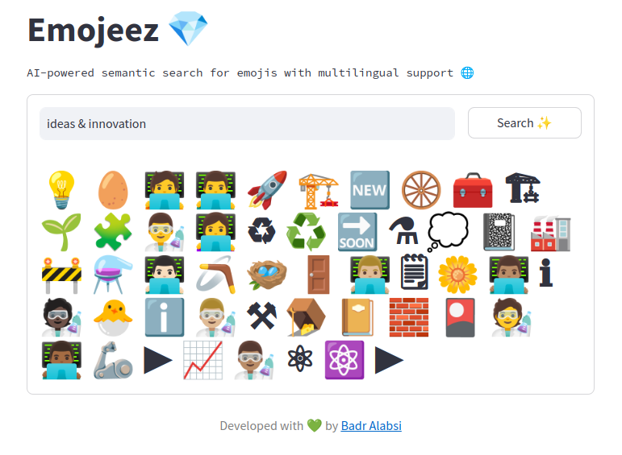

# Emojeez 💎

[](LICENSE)


## 📑 Description

Emojeez 💎 is an AI-powered semantic search application designed to help users discover and explore emojis. It was developed using advanced natural language processing (NLP) technologies to understand users' text queries and respond with relevant emojis. Emojeez 💎 features a multilingual support for more 50 languages, enabling exploratory search for users with diverse linguistic backgrounds. 

Try out Emojeez 💎 [here](https://emojeez.streamlit.app/).





## 🪄 Core Features

 - **Advanced Semantic Emoji Search** 🔎 Utilize our embedding-based search algorithm to find emojis that best match the contextual meaning of phrases and commonly used expressions. This functionality is powered by the integration of [Qdrant](https://qdrant.tech/)'s vector database and the powerful 🤗 [Transformers](https://huggingface.co/docs/transformers/en/index) to build an efficient semantic search engine.

 - **LLM-Generated Emoji Descriptions** 🦜 Go beyond simple string matching and experience the power of Large Language Models (LLMs) for better semantic search. Emojeez 💎 utilizes enriched semantic descriptions generated by Meta AI's Llama-3-8B model. These descriptions not only define each emoji and its symbolism but also provide better contextualization of its usage in today's text-based communication. For more information, see this 🤗 [Dataset](https://huggingface.co/datasets/badrabdullah/llm-emoji-dataset). 

- **Efficient Indexing for Thousands of Emojis** ✨  Explore more than 5000 emojis based on the most recent Unicode standards. While each emoji is searchable by its standard name, you can also discover emojis by their common usage in today's text-based communication. For example, the text query *great ambition* returns 🚀, while *idea* returns 💡.

- **Comprehensive Multilingual Support** 🌐 Discover emojis using your native language! This feature is facilitated by a Transformer-based multilingual encoder that supports over 50 languages.

- **Intuitive User Interface** Interact with 🖥️ Emojeez 💎 via an intuitive user-friendly interface built with [Streamlit](https://streamlit.io/).


## 🌱 Getting Started

These instructions will get you a copy of the project up and running on your local machine for development and testing purposes.

### Prerequisites

What you need to install the software:

- Python 3.11+
- Qdrant
- Sentence Transformers
- Streamlit


### Local Installation

1. Clone the repository:
   ```bash
   git clone https://github.com/badrex/emojeez.git

2. Navigate to the project directory:

    ```bash
    cd emojeez

3. Install the required packages:

    ```bash
    pip install -r requirements.txt

4. Running the Application

    ```bash
    streamlit run search_emojis_app.py

## ℹ️ How to Use Emojeez 💎

After launching the app, you will see a text input where you can type your query. Enter a phrase or a keyword or a keyphrase, and the app will display emojis based on semantic similarity with your text input. The app use is optimized when the search query is a phrase or a full sentence.


### Examples 

Here, I provide a few exampels of text queries and the output of the search algorithm


<font size="4">

| Query | Top 10 Emojis |
|----------|----------|
| great ambition  | 🚀 ⚒ 💯 💸 🎯 🧗 🧗‍♂ 🧗🏽‍♂ 🏃‍♀️ 🧗🏾‍♂️  |
| innovative idea  | 💡 🥚 🧰 🧑‍💻 🚀 🧩 🛞 🌱 💭 🪤  |
| extinct  | 🦣 🏚️ 🦖 🏚 🧟‍♀ 🦤 🦕 🧟‍♀️ 🧟‍♂ 🧟‍♂️ |
| animal that builds dams | 🦫 🐃 🐏 🐐 🦬 🦦 🐂 🦛 🐺 🦙 |
| protect from evil eye | 🧿 👓 🥽 👁 🦹🏻 👀 🦹🏿 🛡️ 🦹🏼 🦹🏻‍♂ |
| popular sport in the USA | ⚾ 🏐 🏀 🏈 🥍 🏓 🏑 🤾‍♂ 🤾‍♂️ 🎾 |
| extraterrestrial | 👽 🛸 👾 👩🏼‍🚀 👩‍🚀 🧑‍🚀 👨‍🚀 👩🏽‍🚀 🧑🏻‍🚀 👩🏾‍🚀 |
| heart gesture with hand | 🫶🏽 🫶🏿 🫶🏾 🫶🏻 🫶🏼 💁🏼‍♂ 🙌🏽 🤟 🫶 🙌 |

</font>


## 🫶🏼 Contributions

If you would like to contribute to Emojeez 💎, I warmly welcome your contribution 😊 Start by forking the repository and then propose your changes through a pull request. Contributions of all kinds are welcome, from new features and bug fixes to development of test cases. Your input will be highly valued ⭐


## 🤙🏼 Get in Touch! 

Try out Emojeez 💎 in your language and let me know how you like it 😊

Developed with 💚 by [Badr Alabsi](https://badrex.github.io/) 👨🏻‍💻